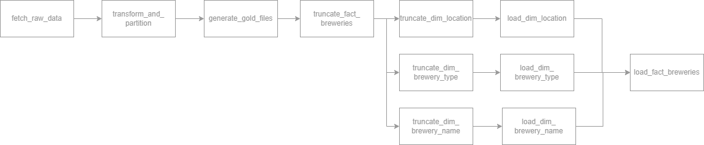

# Projeto ETL - Open Brewery DB (Airflow)

## Visão Geral

## Introdução

O projeto **Breweries Data Pipeline** foi desenvolvido para demonstrar, na prática, os conceitos de arquitetura de dados moderna, com ênfase em pipelines ELT (Extract, Load, Transform) robustos, rastreáveis e escaláveis.

Utilizando dados públicos do [Open Brewery DB](https://www.openbrewerydb.org/), esta solução implementa todas as etapas essenciais de um pipeline analítico — desde a ingestão e tratamento de dados brutos (camadas Bronze, Silver e Gold) até a carga em um Data Warehouse relacional (PostgreSQL), culminando em um dashboard dinâmico no Power BI.

O pipeline está completamente orquestrado pelo **Apache Airflow** e foi concebido para ser facilmente executado em ambientes locais usando Docker, facilitando testes, evolução e deploy em ambientes reais de produção.

### Destaques do projeto

* **Padrão de Camadas (Bronze, Silver, Gold):** Facilita rastreabilidade, auditoria, reprocessamento e governança dos dados.
* **Data Warehouse relacional:** Modelo dimensional pronto para análises rápidas e históricas.
* **Automação e orquestração:** Todas as etapas controladas por DAGs no Airflow.
* **Qualidade de dados:** Tratamento de valores nulos, caracteres especiais e padronização já implementados nos scripts.
* **Dashboard pronto para consumo:** Power BI conectado ao DW com exemplos de análises.
* **Reprodutibilidade total:** Pipeline preparado para subir em minutos com Docker Compose.

Este repositório serve como base tanto para aprendizado quanto para aplicação direta em cenários reais de engenharia de dados, podendo ser expandido para outras fontes, outros domínios de negócio ou camadas de validação mais sofisticadas

Este projeto implementa um pipeline ETL completo para ingestão, transformação e carga de dados da API [Open Brewery DB](https://www.openbrewerydb.org/), utilizando Apache Airflow, Python e PostgreSQL. O fluxo cobre desde a ingestão bruta (bronze), passando por transformação (silver), particionamento (gold) e carga das dimensões e fatos em um Data Warehouse relacional.

## Arquitetura do Pipeline

O pipeline é composto por múltiplas camadas:

1. **Ingestão (Bronze)** : Coleta dados crus da API Open Brewery e armazena em arquivos JSON.
2. **Transformação (Silver)** : Limpa, normaliza e padroniza os dados, salvando em formato Parquet.
3. **Modelagem (Gold)** : Organiza os dados em Parquet particionado por país/estado, prontos para consumo analítico.
4. **Carga no Data Warehouse** : Popula tabelas dimensionais e fato em um banco relacional PostgreSQL.
5. **Consumo analítico** : Conecta o DW ao Power BI para criação de dashboards interativos
6. **Bronze**: Coleta e armazenamento dos dados brutos da API, no formato JSON.
7. **Silver**: Normalização, limpeza e padronização dos dados, convertendo para Parquet.
8. **Gold**: Particionamento dos dados por país/estado, prontos para ingestão no DW.
9. **DW**: Carregamento das dimensões e tabela fato no PostgreSQL.

Macro processo de ETL:

Micro processo de ETL no Airflow

## Como executar

1. **Clone o projeto e suba o ambiente Docker:**

   git clone https://github.com/renatoweb76/test_ab_inbev.git
   cd seurepo
   docker compose up -d
2. **Acesse o Airflow:**

http://localhost:8080
usuário/senha padrão: admin/QSSXNyCFpanp3cMK

2.1. Execute a DAG breweries_etl_full
2.1.1. Ela executa toda a pipeline (bronze → silver → gold → carga no DW).

3. **Acesse o Banco de Dados Postgres**
4. Baixe o Dbever Community: https://dbeaver.io/download/
5. Crie uma nova conexão com o Database breweries_dw
6. Utilize o usuário/senha airflow/airflow
7. Abara o Schema dw e veja as tabelas criadas.

## Estrutura dos scripts:

1. bronze_layer_full.py:              Busca dados brutos da API e salva em JSON.
2. silver_layer_full.py:              Limpa, normaliza e salva em Parquet único.
3. gold_layer_full.py:                Particiona Parquet por país/estado.
4. load_dw/load_dim_location.py:      Carrega dimensão de localização.
5. load_dw/load_dim_brewery_type.py:  Carrega dimensão de tipo de cervejaria.
6. load_dw/load_dim_brewery_name.py:  Carrega dimensão de nome de cervejaria.
7. load_dw/load_fact_breweries.py:    Carrega tabela fato principal.

## Qualidade de Dados e Validações:

1. Caracteres inválidos tratados a partir da silver layer.
2. Checagem de FKs inválidas e descartes na carga da fato.
3. Prints, logs e mensagens em todas as etapas para debugging.

## Dashboard Power BI

Um dashboard em Power BI foi criado para visualizar as principais métricas extraídas do Data Warehouse, incluindo:

- Número de cervejarias por país e estado
- Tipos mais comuns de cervejarias
- Outras análises relevantes

### Como acessar

* O arquivo .pbix está disponível na pasta `/dashboard`
* Exemplos de visualizações:
